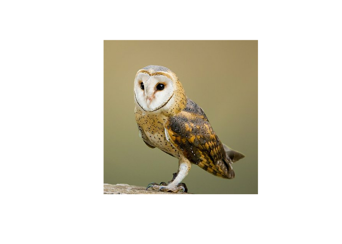

rowlbot
=======

An R Client for the [OWLBOT](https://owlbot.info/) API.

Installation
============

    remotes::install_github("inSileco/rowlbot")

Example
=======

    library(rowlbot)
    ex <- rowlbot("owl")
    ex

    ## ── owl /oul/ ───────────────────────────────────────────────────────────

    ## 1. noun

    ##   ● a nocturnal bird of prey with large eyes, a facial disc, a hooked
    ##     beak, and typically a loud hooting call.

    ##   ● ex: "I love reaching out into that absolute silence, when you can
    ##     hear the owl or the wind."

    ##   ● emoji: 🦉

    ##   ● image available use `plot()`

So let’s plot

    plot(ex)

What for?
=========

No reason - just for fun.
